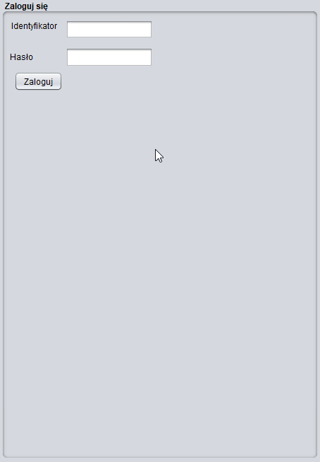

# Filmoteka
> Asynchroniczny menadżer wypożyczalni filmów. Napisany w 2014r. 

Prototyp aplikacji dla wypożyczalni filmów.
Obsługuje:
- wypożyczenia
- zwroty
- obsługę klientów (wyszukiwanie, dodawanie, modyfikowanie, usuwanie)
- obsługę pracowników (dodawanie, modyfikowanie, usuwanie)
- System [uprawnień](https://github.com/mswierkocki/Filmoteka/blob/master/src/model/Pracownik.java#L97), Kasjer, Kierownik, Menadżer.
- Magazyn filmów(dodawanie nowych, modyfikacja, obsługa stanu magazynu)
- Historia zamówień.

***
Technologie: Java, Myslq

## Podgląd
